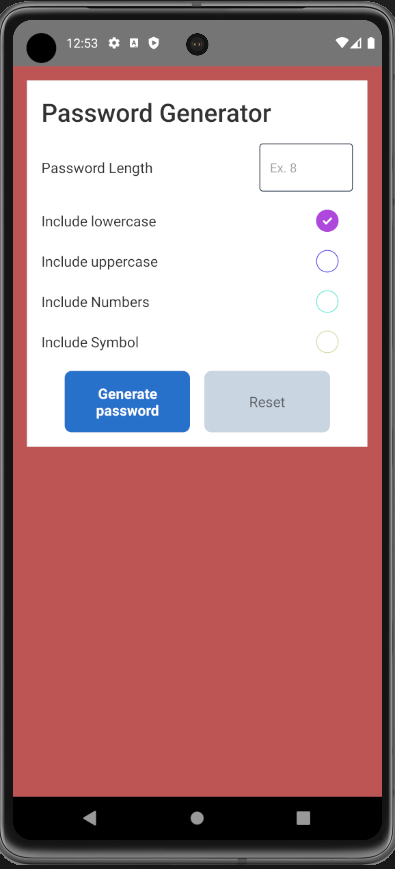

# Password Generator - React Native CLI Project

## Introduction

This React Native CLI project is a simple and customizable password generator. It allows you to generate strong, random passwords with various options to meet your security requirements.

## Features

- Generate strong and random passwords.
- Customize the length of the password.
- Include or exclude uppercase letters, lowercase letters, numbers, and special characters.
- Copy generated passwords to your clipboard with a single click.

